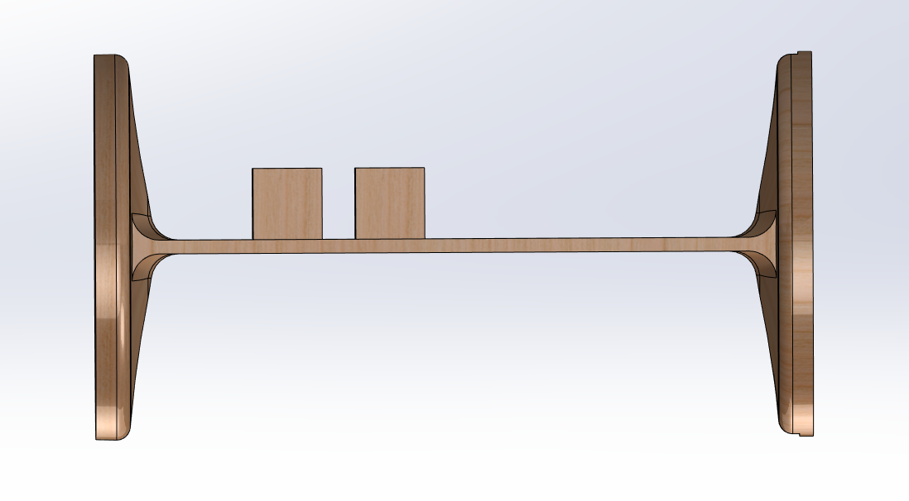

# Rocket Technical Design

This project covers my technical contributions to the 2018-2019 Washington State University Aerospace Club.

## Author

[Jonathan Cochran](https://github.com/ionzzu)

## Background

- Testing rocket the club built to attempt a new air brake system
- An air brake controls ascent of rocket by increasing drag with a feedback algorithm

## Directory
- [Velocity Simulation](#velocity-simulation): simulate rocket trajectory based on CFD analysis values and motor specifications
- [Recovery Ejection](#recovery-ejection): ejection calculations for deploying parachute recovery system
- [Static Simulation](#static-simulation): static simulations to characterize forces on rocket body when air brake closed/deployed
- [Electronics Bay Design](#electronics-bay-design): carved wood bay to contain electronics module and fit within rocket tube

## Velocity Simulation

- MATLAB simulation to model trajectory ([velocity_sim.m](velocity_sim.m))
- Modeled drag as a function of velocity, thrust as a function of time for motor, and mass loss as a function of time from motor

## Recovery Ejection

- Calculated grams of black powder necessary to eject a parachute from the top of the rocket
- Must not over-estimate or structure stability could be compromised

## Static Simulation

- Static study in SolidWorks Simulations to examine the force applied to rocket body when air brake is fully closed and extended
- Evaluated at top speed of 1100 ft/s and at the speed off launch rail of 65 ft/s
- Applied an orthogonal fiberglass-epoxy resin material to the body tubes
    - Values for this material derived from performance-composites E-glass Fabric
    - Applied 0° values for Y direction and the 90° values for X and Z directions
        - X and Z are perpendicular to the Y direction so they will have the same values with reference to the Y direction
- Top Speed (1100 ft/s)
    - Extended: 76.38N
    - Closed: 65.97N
- Speed off rail (65 ft/s)
    - Extended: 4.89N
    - Closed: 3.96N

## Electronics Bay Design

- Designed an electronics bay to hold electronics module
- Fits inner diameter of rocket tube
- Holes in bottom for wires to feed through
- Fastener locations for securing electronics board to the bay
- Raised edges for holding additional electronics equipment
- Manufacturing consideration is for wood to be cut and placed in manner presented
    - Fastening mechanisms were glue, screws, and friction

#### Isometric View

#### Bottom View

#### Side View

#### Top View

#### Mount View

## Acknowledgment

Thank you to [WSU Aerospace](https://hub.wsu.edu/aerospace/) for the experience!
